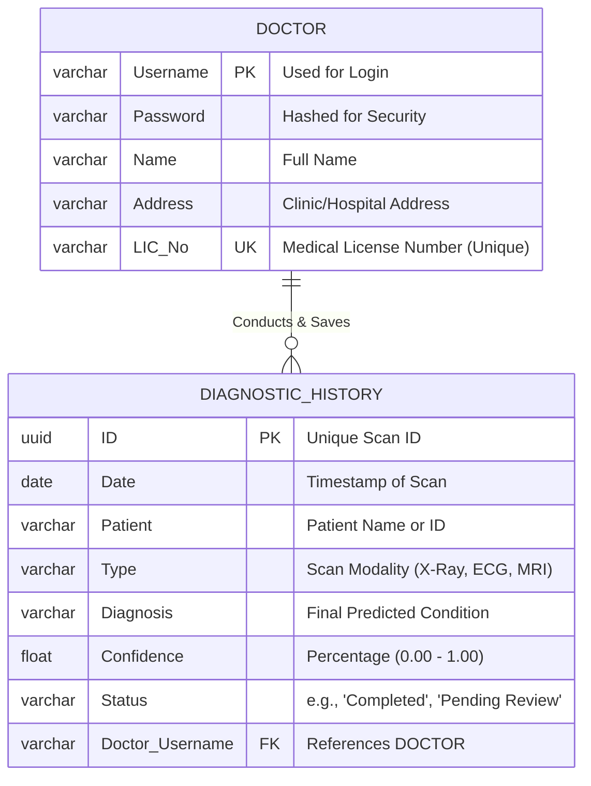

# Z-Ray: Tri-Modal Medical Diagnostic Engine 🩺

[](https://github.com/Zeta-Coders/Z-Ray)
[](https://github.com/Zeta-Coders/Z-Ray)
[](https://github.com/Zeta-Coders/Z-Ray)

**Z-Ray** is a high-performance, multi-modal AI diagnostic suite developed by **Zeta Coders**. It integrates X-Ray, MRI, and ECG analysis into a unified "Glass-Box" dashboard, providing clinicians with high-accuracy predictions backed by visual heatmaps and clinical fusion.

---

## 🚀 Core Engine Architecture

### Data Flow Diagram (DFD)
```mermaid
%%{init: {'theme': 'base', 'themeVariables': { 'primaryColor': '#3b82f6', 'edgeLabelBackground':'#ffffff', 'tertiaryColor': '#fff'}}}%%
graph TD
    %% --- Modern Styling classDefinitions ---
    classDef External fill:#f97316,stroke:#ea580c,stroke-width:2px,color:white,rx:5,ry:5;
    classDef WebUI fill:#e0f2fe,stroke:#0284c7,stroke-width:2px,color:#0c4a6e,rx:10,ry:10;
    classDef BackendRouter fill:#ecfdf5,stroke:#059669,stroke-width:2px,color:#064e3b,rx:15,ry:15,stroke-dasharray: 5 5;
    classDef PreProcess fill:#f1f5f9,stroke:#64748b,stroke-width:1px,color:#0f172a,stroke-dasharray: 3 3;
    classDef NeuralNet fill:#dcfce7,stroke:#16a34a,stroke-width:2px,color:#14532d;
    classDef ClinicalFusion fill:#f5f3ff,stroke:#7c3aed,stroke-width:2px,color:#4c1d95,font-weight:bold;
    classDef DataStore fill:#fff7ed,stroke:#c2410c,stroke-width:2px,color:#7c2d12,stroke-dasharray: 8 4;

    %% --- Entities ---
    E_Doctor[("fa:fa-user-md<br/>Doctor")]:::External
    E_FileSystem[("fa:fa-file<br/>Local File<br/>System")]:::External

    %% --- Main processes ---
    P_WebUI("fa:fa-desktop<br/>Vite / Tailwind<br/>WebUI"):::WebUI
    P_FastAPIGateway("fa:fa-server<br/>FastAPI<br/>API Gateway Router"):::BackendRouter
    P_OutputFormatter("fa:fa-file-signature<br/>Result Formatter &<br/>Reasoning Logic"):::BackendRouter

    %% --- Subgraphs for detailing pipelines ---
    subgraph SG_DataInput ["1. Data Acquisition"]
        I_FormInput[("Age, Gender,<br/>History (Tabular)")]:::External
    end

    subgraph SG_XRay ["2. X-Ray Modality Pipeline"]
        P_XrayPrep("fa:fa-image OpenCV<br/>Resize [224,224]<br/>Grayscale to RGB<br/>Normalize"):::PreProcess
        P_DenseNetONNX("fa:fa-microchip ONNX<br/>DenseNet121<br/>Feature Extractor<br/>(Weights: Scratch)"):::NeuralNet
        P_XrayRF("fa:fa-brain scikit-learn<br/>Random Forest<br/>Pathology Classifier<br/>(15 Classes)"):::ClinicalFusion
    end

    subgraph SG_ECG ["3. ECG Modality Pipeline"]
        P_EcgPrep("fa:fa-signal Pandas/Numpy<br/>Load CSV [1000,12]<br/>Transpose [12,1000]<br/>Standard Scale"):::PreProcess
        P_ResNet1ONNX("fa:fa-microchip ONNX<br/>1D-ResNet<br/>Temporal Extractor<br/>(Weights: Scratch)"):::NeuralNet
        P_EcgRF("fa:fa-brain scikit-learn<br/>Random Forest<br/>Superclass Classifier<br/>(5 Classes)"):::ClinicalFusion
    end

    subgraph SG_MRI ["4. MRI Modality Pipeline"]
        P_MriPrep("fa:fa-cube Numpy<br/>2.5D Slice Stacking<br/>Normalize"):::PreProcess
        P_VggONNX("fa:fa-microchip ONNX<br/>VGG16<br/>Volume Extractor<br/>(Weights: Scratch)"):::NeuralNet
        P_MriRF("fa:fa-brain scikit-learn<br/>Random Forest<br/>Structural Classifier<br/>(3 Classes)"):::ClinicalFusion
    end

    %% --- Data Stores ---
    D_Postgres[(fa:fa-database SQLite (Flask)<br/>Patient Diagnostic Records)]:::DataStore

    %% --- DATA FLOWS ---

    %% 1. Upload & Route
    E_Doctor -. Selects File .-> E_FileSystem
    E_FileSystem -- Raw PNG / CSV / Array --> P_WebUI
    I_FormInput -- Demographics (Integers) --> P_WebUI
    
    P_WebUI == POST request FormData<br/>(File + Tabular Data) ==> P_FastAPIGateway

    %% 2. Internal Decoupled Processing (modality routing)
    P_FastAPIGateway -- Raw Image/MRI Buffer --> P_XrayPrep
    P_FastAPIGateway -- Raw Image/MRI Buffer --> P_MriPrep
    P_FastAPIGateway -- Raw CSV Buffer --> P_EcgPrep
    P_FastAPIGateway -- Demographics --> SG_XRay & SG_ECG & SG_MRI

    %% Detailed Modal Flows
    P_XrayPrep -- Preprocessed Tensor<br/>[1, 3, 224, 224] --> P_DenseNetONNX
    P_DenseNetONNX -- 15 AI Probabilities --> P_XrayRF
    P_FastAPIGateway -- Tabular History --> P_XrayRF
    P_XrayRF -- Diagnostic Conclusion + Confidence --> P_OutputFormatter

    P_EcgPrep -- Preprocessed Tensor<br/>[1, 12, 1000] --> P_ResNet1ONNX
    P_ResNet1ONNX -- 5 AI Probabilities --> P_EcgRF
    P_FastAPIGateway -- Tabular History --> P_EcgRF
    P_EcgRF -- Diagnostic Conclusion + Confidence --> P_OutputFormatter

    P_MriPrep -- Preprocessed Tensor<br/>[1, 3, 224, 224] --> P_VggONNX
    P_VggONNX -- 3 AI Probabilities --> P_MriRF
    P_FastAPIGateway -- Tabular History --> P_MriRF
    P_MriRF -- Diagnostic Conclusion + Confidence --> P_OutputFormatter

    %% 3. Fusion, Glass-Box Reasoning, & Storage
    P_OutputFormatter -- Maps Diagnosis to<br/>Clinical Rules --> P_OutputFormatter
    P_OutputFormatter == Generates 'Reasoning' Array<br/>(Glass-Box Strings) ==> P_OutputFormatter
    
    P_FastAPIGateway -- Patient demographics --> P_OutputFormatter

    P_OutputFormatter -- Structured Records<br/>(Diag, Conf, Reason, Date) --> D_Postgres
    D_Postgres -- Confirm Save --> P_OutputFormatter

    %% 4. Response back to UI
    P_OutputFormatter == JSON Response<br/>(Full Diagnostic Payload) ==> P_FastAPIGateway
    P_FastAPIGateway == JSON Response payload ==> P_WebUI
    P_WebUI == Dynamic Rendering ==> E_Doctor
```

### Entity-Relationship (ER) Diagram


Z-Ray utilizes three distinct specialized engines to provide a 360-degree diagnostic view:

### 1. Vision Engine (Chest X-Ray)
* **Backbone:** MobileNetV3-Large (Optimized for edge deployment).
* **Dataset:** NIH Chest X-ray 14 (112,120 clinical images).
* **Feature:** **Grad-CAM Explainability** – Heatmaps that highlight exactly where the AI detects pathologies like Atelectasis or Pneumonia, ensuring clinical trust.

### 2. Volumetric Engine (Knee MRI)
* **Strategy:** **2.5D Spatial Stacking** – Processes 3D MRI slices as multi-channel inputs to capture structural depth without the computational cost of 3D CNNs.
* **Hybrid Reasoning:** Combines AI vision probabilities with patient clinical data (pain level, swelling) using a **Random Forest Fusion** model.

### 3. Signal Engine (12-Lead ECG)
* **Architecture:** 1D-Residual Network (1D-ResNet).
* **Dataset:** PTB-XL Clinical Dataset (100Hz signals).
* **Optimization:** **OneCycleLR Scheduling** – Reaches 90%+ diagnostic accuracy through dynamic learning rate adjustment.

---

## 🛠️ Systems Engineering & Optimization

As a project designed for real-world utility on constrained devices (like a **Redmi Note 7 Pro**), Z-Ray employs advanced optimization techniques:

* **INT8 Quantization:** Models are compressed from FP32 to INT8, reducing file sizes by ~75% while maintaining >98% of original accuracy.
* **ONNX Runtime:** Unified cross-platform inference that allows the backend to run on non-dGPU hardware (Ryzen 5 6600H) with millisecond latency.
* **FOSS Priority:** Built entirely using Free and Open Source Software (Fedora, PyTorch, MONAI, FastAPI).

---

## 📂 Project Structure

```text
Z-Ray/
├── models/
│   ├── xray/          # MobileNetV3 + Grad-CAM Logic
│   ├── ecg/           # 1D-ResNet Signal Processor
│   └── mri/           # 2.5D Stacking + Fusion Engine
├── deployment/
│   └── onnx_assets/   # INT8 Quantized Production Models
├── web-backend/       # FastAPI Gateway (Unified Inference API)
└── web-frontend/      # Vite + React Dashboard (Zeta-UI)
