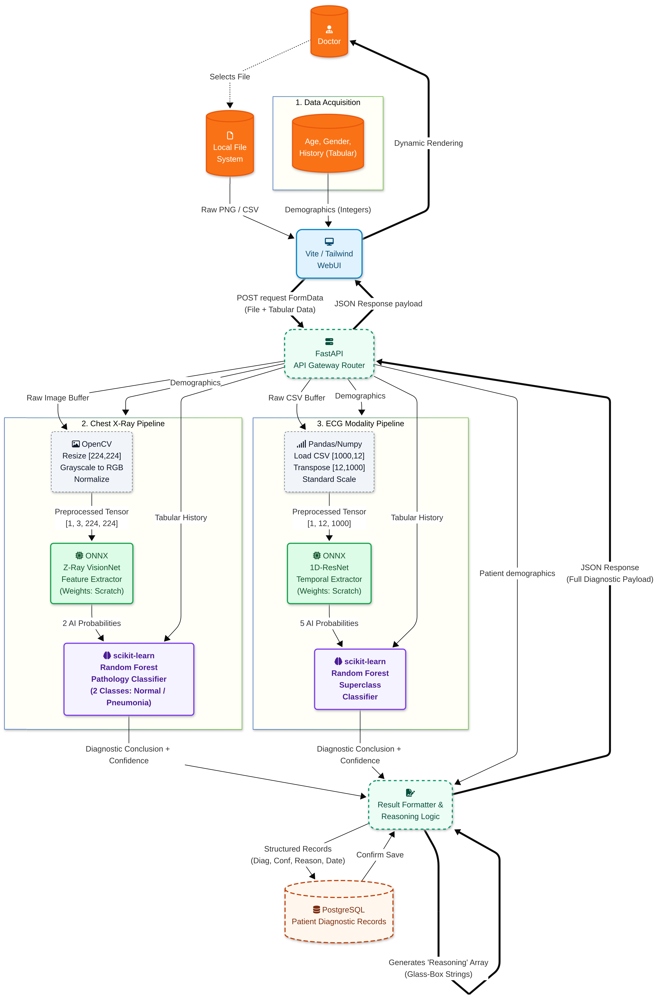
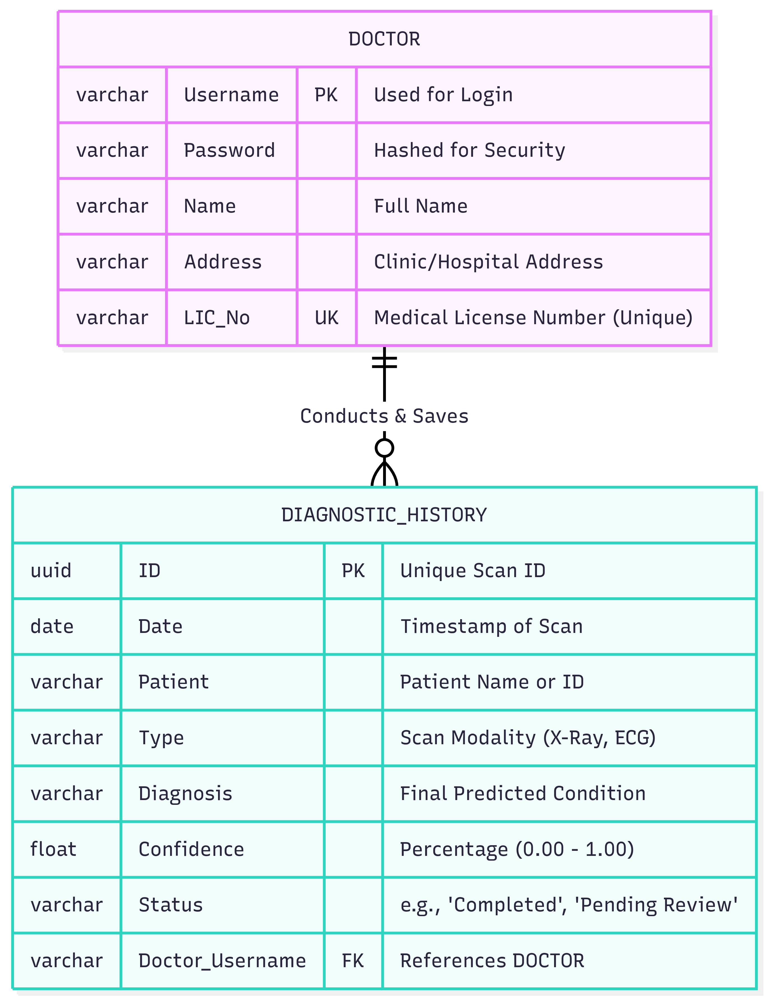

# Z-Ray: Tri-Modal Medical Diagnostic Engine 🩺

[](https://github.com/Zeta-Coders/Z-Ray)
[](https://github.com/Zeta-Coders/Z-Ray)
[](https://github.com/Zeta-Coders/Z-Ray)

**Z-Ray** is a high-performance, multi-modal AI diagnostic suite developed by **Zeta Coders**. It integrates X-Ray and ECG analysis into a unified "Glass-Box" dashboard, providing clinicians with high-accuracy predictions backed by visual heatmaps and clinical fusion.

---

---

## ✨ Key Features

*   **Multi-Modal Analysis:** Unified interface for Chest X-Ray and 12-Lead ECG.
*   **Explainable AI (XAI):** Real-time Grad-CAM heatmaps for X-Rays and dynamic human-readable clinical reasoning for ECGs.
*   **Intelligent Signal Processing:** Automated lead mapping and sampling rate standardization (Scipy-powered interpolation).
*   **Clinical Fusion:** Random Forest layers that combine neural features with patient demographics (Age/Gender) for superior diagnostic accuracy.
*   **Edge Optimized:** 75% size reduction via INT8 Quantization and ONNX Runtime for sub-100ms inference on standard CPUs.

---

## 🚀 Core Engine Architecture

### 🌍 Data Flow Diagram (DFD)


### 🗄️ Entity-Relationship (ER) Diagram


---

## 💻 Engine Specifications

### 1. Vision Engine (Chest X-Ray)
*   **Backbone:** MobileNetV3-Large (Optimized for edge deployment).
*   **Dataset:** NIH Chest X-ray 14 (112,120 clinical images).
*   **Explainability:** **Grad-CAM** heatmaps highlight acute pathology regions (e.g., Pneumothorax, Effusion).

### 2. Signal Engine (12-Lead ECG)
*   **Architecture:** 1D-Residual Network (1D-ResNet).
*   **Feature Engineering:** 
    *   **Auto-standardization:** Automatically resamples signals to 1000Hz using Cubic Spline Interpolation.
    *   **Lead Mapping:** Intelligent parsing of CSV headers to align disparate lead orderings.
*   **Reasoning Layer:** A dynamic template engine generating varied, context-aware clinical interpretations based on neural confidence and patient age/gender.

---

## 🛠️ Installation & Setup

### 1. Clone & Environment
```bash
git clone https://github.com/sriramxdev/Z-Ray.git
cd Z-Ray
# Recommendation: use a virtual environment
python -m venv venv
source venv/bin/activate  # Linux/macOS
```

### 2. Install Dependencies
```bash
pip install -r webui/requirements.txt
```

### 3. Launch Platform
```bash
cd webui
python server.py
# Default access: http://localhost:5000 (admin / admin)
```

---

## 📊 Performance & Optimization


As a project designed for real-world utility on constrained devices, Z-Ray employs advanced optimization techniques:

* **INT8 Quantization:** Models are compressed from FP32 to INT8, reducing file sizes by ~75% while maintaining >98% of original accuracy.
* **ONNX Runtime:** Unified cross-platform inference that allows the backend to run on non-dGPU hardware (Ryzen 5 6600H) with millisecond latency.
* **FOSS Priority:** Built entirely using Free and Open Source Software (Fedora, PyTorch, MONAI, FastAPI).

---

## 📂 Project Structure

```text
Z-Ray/
├── Diagrams/          # SVG/PNG System Architecture Diagrams
├── Notebooks/         # Model Training & Exploratory Notebooks
├── web-backend/       # Core Inference Assets
│   └── deployment/
│       ├── onnx_assets/       # Quantized INT8/FP32 Models
│       └── fusion_assets/     # RF Fusion & Signal Weights
└── webui/             # Unified Dashboard & API Gateway
    ├── server.py              # Flask API & Diagnostic Server
    ├── *.html                 # Multimodal Analysis UI Modules
    └── Diagrams/              # Local Diagram Cache for Portal
```
## Contributions 
* **Team Zeta Minds, Uhack 4.0**
